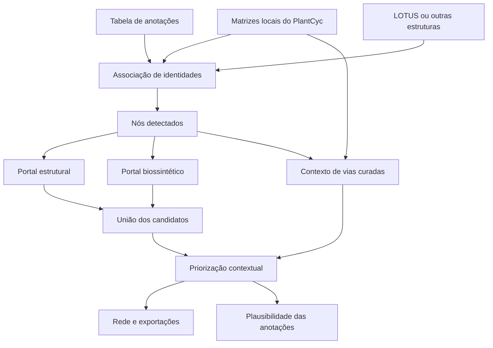

# Biosynthetic Plausibility Mapper

## Tutorial detalhado de instalação, preparação dos dados, análise, validação e interpretação

> **Estado do software:** software científico em desenvolvimento ativo  
> **Versão documentada:** `app(8).py`, agosto de 2026  
> **Desenvolvimento:** LAABio, Instituto de Pesquisas de Produtos Naturais, Universidade Federal do Rio de Janeiro (IPPN–UFRJ)

## Sumário

1. [Objetivo e escopo](#1-objetivo-e-escopo)
2. [O que o programa faz — e o que ele não faz](#2-o-que-o-programa-faz--e-o-que-ele-não-faz)
3. [Fluxo conceitual](#3-fluxo-conceitual)
4. [Fontes de dados e política de redistribuição](#4-fontes-de-dados-e-política-de-redistribuição)
5. [Instalação](#5-instalação)
6. [Preparação da base local derivada do PlantCyc](#6-preparação-da-base-local-derivada-do-plantcyc)
7. [Preparação da tabela de anotações](#7-preparação-da-tabela-de-anotações)
8. [Base opcional de expansão química](#8-base-opcional-de-expansão-química)
9. [Execução do aplicativo](#9-execução-do-aplicativo)
10. [Análise de rotina passo a passo](#10-análise-de-rotina-passo-a-passo)
11. [Interpretação da rede](#11-interpretação-da-rede)
12. [Geração e priorização de candidatos](#12-geração-e-priorização-de-candidatos)
13. [Plausibilidade biossintética por módulo](#13-plausibilidade-biossintética-por-módulo)
14. [Modos de benchmark](#14-modos-de-benchmark)
15. [Exportações e reprodutibilidade](#15-exportações-e-reprodutibilidade)
16. [Modelos de texto para artigos](#16-modelos-de-texto-para-artigos)
17. [Solução de problemas](#17-solução-de-problemas)
18. [Limitações científicas](#18-limitações-científicas)
19. [Como citar e referências](#19-como-citar-e-referências)

---

## 1. Objetivo e escopo

O **Biosynthetic Plausibility Mapper** avalia se as anotações químicas de um estudo de metabolômica vegetal são coerentes com o conhecimento biossintético curado e com as demais substâncias observadas no mesmo estudo.

O aplicativo integra quatro camadas:

1. **Evidência do estudo:** substâncias fornecidas pelo usuário e associadas a estruturas válidas no Atlas.
2. **Biossíntese curada:** relações precursor–produto reconstruídas a partir de uma cópia local autorizada do PlantCyc.
3. **Geração de candidatos:** dois portais independentes, um baseado em similaridade estrutural e outro na conectividade da rede curada.
4. **Interpretação e validação:** priorização de candidatos, estados de plausibilidade, diagnóstico da capacidade de avaliação da base e benchmarks opcionais.

A pergunta central é:

> **Uma anotação proposta faz sentido biossintético diante dos demais metabólitos observados no estudo?**

O programa é uma ferramenta de **geração de hipóteses e revisão de anotações**. Ele deve ser usado depois que o processamento de dados de LC–HRMS/MS, GC–MS ou outra plataforma tiver produzido uma tabela de anotações químicas.

---

## 2. O que o programa faz — e o que ele não faz

### O programa faz

- associa as anotações do estudo a estruturas químicas harmonizadas;
- posiciona os metabólitos associados em uma rede dirigida derivada do PlantCyc;
- acrescenta contexto de vias curadas ao redor dos compostos observados;
- propõe compostos estruturalmente relacionados usando fingerprints de Morgan e similaridade de Tanimoto;
- propõe vizinhos biossintéticos curados independentemente da similaridade estrutural;
- registra a origem de cada candidato;
- prioriza candidatos usando o contexto completo observado;
- atribui um estado biossintético interpretável a cada anotação associada;
- diferencia falta de suporte biológico de falta de cobertura da base;
- exporta redes, tabelas, diagnósticos e resultados de benchmark;
- executa avaliações mascaradas, com decoys estruturais, decoys adversariais e holdout prospectivo.

### O programa não faz

- não detecta substâncias diretamente a partir dos dados brutos de MS;
- não substitui detecção de picos, deconvolução, alinhamento ou anotação espectral;
- não prova que um candidato está presente na amostra;
- não estabelece identidade química apenas pelo contexto biossintético;
- não transforma similaridade estrutural em reação curada;
- não demonstra atividade enzimática a partir da presença de um metabólito;
- não prova que uma via ausente do PlantCyc seja biologicamente impossível;
- não redistribui os arquivos originais do PlantCyc nem contorna suas condições de acesso.

Os resultados devem ser integrados a evidências independentes: massa exata, padrão isotópico, aduto, comportamento cromatográfico, espectro MS/MS, índice ou tempo de retenção e padrão autêntico quando necessário.

---

## 3. Fluxo conceitual



Os portais de candidatos são independentes:

| Portal | Ponto de partida | Evidência | Significado |
|---|---|---|---|
| Estrutural | Compostos detectados | Fingerprints de Morgan e Tanimoto | Estrutura quimicamente semelhante |
| Biossintético | Compostos detectados | Conectividade na rede curada do PlantCyc | Vizinho na rede biossintética curada |

O universo final é a **união** dos dois portais. A origem do candidato informa como ele entrou na análise; não constitui, sozinha, uma classe de confiança.

---

## 4. Fontes de dados e política de redistribuição

### 4.1 PlantCyc e Plant Metabolic Network

O [PlantCyc](https://plantcyc.org/) é a base de referência pan-vegetal do Plant Metabolic Network (PMN). O aplicativo usa uma versão local reprocessada contendo compostos, reações, vias e relações dirigidas entre precursores e produtos.

O PlantCyc fornece a **espinha dorsal biossintética**. Seus arquivos não acompanham este repositório. Cada usuário deve obter os dados pela via oficial e cumprir as condições de acesso, uso, atribuição e redistribuição aplicáveis à versão baixada.

> **Não inclua em um repositório público arquivos baixados do PlantCyc, links privados, credenciais, tokens ou matrizes derivadas sem autorização explícita para redistribuição.**

O código pode ser público enquanto os dados derivados do PlantCyc permanecem locais. Para permitir reprodutibilidade, a publicação deve informar a fonte oficial, a versão da base, a data de obtenção, as regras de transformação e o esquema das matrizes produzidas.

### 4.2 LOTUS

O [LOTUS](https://lotus.naturalproducts.net/) é uma fonte opcional de estruturas de produtos naturais e de relações estrutura–organismo. No Mapper, uma tabela simplificada do LOTUS amplia o espaço químico pesquisável. Ela não substitui o PlantCyc nem cria relações biossintéticas curadas.

A presença de uma estrutura no LOTUS não demonstra sua presença na amostra analisada.

### 4.3 Dados do usuário

A tabela de entrada deve conter apenas os compostos que serão tratados como observados ou anotados no estudo. Colunas quantitativas e estatísticas são preservadas como metadados, mas não definem automaticamente a identidade química.

---

## 5. Instalação

### 5.1 Requisitos

- Python 3.10 ou superior recomendado;
- navegador atualizado;
- memória RAM suficiente para a expansão química escolhida;
- base local autorizada e previamente processada do PlantCyc.

Dependências principais:

- Streamlit;
- pandas;
- NumPy;
- RDKit;
- NetworkX;
- PyVis;
- `openpyxl` para arquivos `.xlsx`;
- Pillow caso seja usado um logotipo na barra lateral.

### 5.2 Ambiente isolado

#### Windows PowerShell

```powershell
py -m venv .venv
.venv\Scripts\Activate.ps1
python -m pip install --upgrade pip
pip install streamlit pandas numpy networkx pyvis rdkit openpyxl pillow
```

#### Linux ou macOS

```bash
python3 -m venv .venv
source .venv/bin/activate
python -m pip install --upgrade pip
pip install streamlit pandas numpy networkx pyvis rdkit openpyxl pillow
```

Congele as versões usadas em uma publicação:

```bash
python -m pip freeze > requirements-lock.txt
```

### 5.3 Estrutura recomendada

```text
Biosynthetic-Plausibility-Mapper/
├── app.py
├── README.md
├── TUTORIAL_PT-BR.md
├── requirements.txt
├── assets/
│   └── logo.png
├── plantcyc_atlas_db/                 # local; não publicar sem autorização
│   ├── atlas_compounds.csv
│   ├── atlas_curated_edges.csv
│   ├── atlas_pathways.csv
│   └── atlas_reactions.csv
└── LOTUS_2021_03_simple.csv           # expansão opcional
```

Proteja os dados no `.gitignore`:

```gitignore
plantcyc_atlas_db/
plantcyc*.tar.gz
LOTUS_2021_03_simple*.csv
```

---

## 6. Preparação da base local derivada do PlantCyc

### 6.1 Obtenção legítima

1. Acesse o site oficial do [PlantCyc/PMN](https://plantcyc.org/).
2. Registre-se ou autentique-se, se necessário.
3. Leia os termos e as instruções da versão escolhida.
4. Baixe a versão autorizada.
5. Registre versão, data de obtenção e fonte em um manifesto local.
6. Mantenha o arquivo original fora do histórico público do Git.

### 6.2 Princípio do reprocessamento

Os registros nativos são reorganizados em matrizes adequadas à análise. O processamento deve:

1. ler compostos e seus identificadores;
2. preservar os identificadores estáveis dos frames do PlantCyc;
3. reter nomes, sinônimos, estruturas, InChIKeys, `TYPES` e vias;
4. ler registros de vias e reações;
5. resolver os lados das reações em pares de compostos;
6. preservar direção apenas quando sustentada pela fonte;
7. manter reação, enzima, EC, via, evidência e proveniência;
8. exportar as quatro matrizes exigidas;
9. auditar endpoints não resolvidos e estruturas genéricas.

O `app.py` atual **carrega as matrizes já produzidas, mas não é o parser dos arquivos brutos do PlantCyc**. A reprodução completa exige um script separado que receba uma cópia local autorizada e gere as matrizes sem baixar, embutir ou redistribuir os dados protegidos.

### 6.3 `atlas_compounds.csv`

| Coluna | Necessária | Descrição |
|---|---:|---|
| `record_id` | Sim | Identificador único do composto |
| `name` | Recomendada | Nome preferencial |
| `smiles` | Recomendada | Estrutura molecular válida |
| `inchikey` | Recomendada | Identificador robusto para associação |
| `lotus_id` | Não | Referência cruzada do LOTUS |
| `class` | Não | Classe química |
| `superclass` | Não | Superclasse química ampla |
| `pathway` | Não | Uma ou mais vias, separadas por `|` |
| `organism` | Não | Organismo de origem |
| `taxonomy` | Não | Informação taxonômica |
| `types` | Recomendada | Valores originais de `TYPES` |
| `source_database` | Recomendada | `PlantCyc` para linhas derivadas da base |
| `classification_source` | Recomendada | Proveniência da classificação |

O programa pode gerar IDs faltantes a partir de LOTUS ID, InChIKey, nome ou `CMPD_n`, mas identificadores explícitos e estáveis são preferíveis.

### 6.4 `atlas_curated_edges.csv`

| Coluna | Necessária | Descrição |
|---|---:|---|
| `source` | Sim | Endpoint precursor |
| `target` | Sim | Endpoint produto |
| `reaction` | Recomendada | Nome ou identificador da reação |
| `enzyme` | Não | Nome da enzima |
| `ec_number` | Não | Número EC |
| `pathway` | Recomendada | Via curada |
| `evidence` | Recomendada | Evidência ou proveniência |
| `confidence` | Não | Valor entre 0 e 1; padrão 1 |
| `directed` | Não | Booleano; padrão `True` |

Os endpoints são resolvidos nesta ordem:

1. InChIKey;
2. SMILES canônico;
3. ID explícito, quando único;
4. nome ou sinônimo, de modo conservador.

### 6.5 `atlas_pathways.csv` e `atlas_reactions.csv`

`atlas_pathways.csv` deve preservar ID e nome da via, `TYPES`, espécie, evidência, citações e versão da fonte.

`atlas_reactions.csv` deve preservar ID e nome da reação, participantes, direção, enzima, número EC, vias, evidências e proveniência.

### 6.6 Proveniência da classificação

- Classes e superclasses existentes são preservadas.
- Quando `class` está vazia, o primeiro pai informativo em `TYPES` pode ser usado e marcado como **`PlantCyc TYPES`**.
- Quando `superclass` está vazia, uma categoria ampla pode ser inferida por palavras-chave e marcada como **`Atlas heuristic from PlantCyc TYPES/pathway`**.
- Pais genéricos, como `Compounds`, `Acceptors` e `Donors`, não geram uma classe inventada.

Preserve `classification_source` nas exportações e diferencie classificações originais de classificações heurísticas no artigo.

### 6.7 Controle de qualidade

Verifique:

- unicidade de `record_id`;
- validade e canonização dos SMILES;
- normalização dos InChIKeys;
- ausência de endpoints vazios;
- método usado para resolver cada endpoint;
- duplicação de reações;
- estruturas genéricas, poliméricas ou incompatíveis com RDKit;
- direção e reversibilidade;
- manutenção das evidências originais;
- contagens de compostos, vias, reações e arestas resolvidas.

Versione publicamente o **código de processamento e o manifesto**, não os dados protegidos.

---

## 7. Preparação da tabela de anotações

### 7.1 Formatos aceitos

- `.csv`
- `.tsv`
- `.xlsx`
- `.xls`

### 7.2 Ordem de associação

| Prioridade | Coluna padrão | Exemplos de nomes aceitos |
|---:|---|---|
| 1 | `inchikey` | `inchi_key`, `inchi key` |
| 2 | `lotus_id` | `lotusid`, `lotus id` |
| 3 | `smiles` | `canonical_smiles`, `isomeric_smiles` |
| 4 | `name` | `compound`, `compound_name`, `metabolite_name` |

Use InChIKey sempre que possível. A associação por nome é menos robusta devido a sinônimos, grafia, sais e descritores estereoquímicos.

### 7.3 Exemplo mínimo

```csv
record_id,name,inchikey,smiles,confidence_level,feature_id
ANN_001,caffeic acid,QAIPRVGONGVQAS-DUXPYHPUSA-N,O=C(O)/C=C/c1ccc(O)c(O)c1,2,F1042
ANN_002,naringenin,FTVWIRXFELQLPI-ZDUSSCGKSA-N,O=C1CC(c2ccc(O)cc2)Oc2cc(O)cc(O)c21,3,F1884
```

### 7.4 Metadados adicionais

Podem ser mantidos `feature_id`, `mz`, `retention_time`, `ion_mode`, `adduct`, `msms_score`, `annotation_level`, `fold_change`, `p_value`, `q_value`, `VIP`, grupo, abundância e observações.

Esses campos auxiliam a auditoria, mas só representam evidência de identidade se isso estiver explicitamente definido no fluxo analítico.

### 7.5 Boas práticas

- use uma linha por anotação;
- preserve a estereoquímica sustentada pelos dados;
- não coloque identidades alternativas na mesma célula;
- use linhas separadas para hipóteses isoméricas;
- remova linhas vazias e títulos acima do cabeçalho;
- use ponto decimal nos valores numéricos;
- congele o arquivo de entrada de cada análise;
- não inclua holdouts prospectivos no conjunto visível.

---

## 8. Base opcional de expansão química

A base de expansão usa o mesmo esquema de compostos. O aplicativo reconhece `LOTUS_2021_03_simple.csv` ou `LOTUS_2021_03_simple(2).csv`, mas também aceita outra tabela enviada pelo usuário.

Os compostos do PlantCyc continuam sendo a referência biossintética. Registros da expansão são acrescentados apenas quando não estão representados no PlantCyc.

Modos de carregamento:

- **25.000 registros:** teste rápido;
- **50.000 registros:** protótipo;
- **100.000 registros:** busca ampliada;
- **base completa:** maior cobertura e maior demanda computacional.

Uma base maior pode aumentar a cobertura, mas também aumenta o tempo, a memória e o número de alternativas estruturalmente plausíveis. Registre a base e o limite de linhas utilizados.

---

## 9. Execução do aplicativo

No diretório do projeto:

```bash
streamlit run app.py
```

O Streamlit abrirá o aplicativo no navegador. Para encerrar, use `Ctrl+C` no terminal.

---

## 10. Análise de rotina passo a passo

### Etapa 1 — Confirmar a base do PlantCyc

A barra lateral deve mostrar **PlantCyc database detected**. Use **Refresh knowledge-base cache** somente depois de substituir arquivos da base durante uma sessão.

### Etapa 2 — Enviar as anotações

Carregue a tabela em **Detected or annotated compounds**. Esse arquivo define o contexto observado.

### Etapa 3 — Configurar a expansão química

Ative a expansão para procurar candidatos além do PlantCyc. Comece com 25.000 ou 50.000 registros. Use a base completa depois de validar o fluxo.

### Etapa 4 — Configurar o portal biossintético

- **Generate biosynthetic candidates:** normalmente ativado;
- **Biosynthetic candidate depth:** distância máxima na rede; comece em `1`;
- **Add additional curated pathway context:** adiciona contexto visual, não detecção;
- **Additional curated context depth:** comece em `1`.

Profundidades maiores ampliam o contexto, mas produzem redes menos específicas.

### Etapa 5 — Configurar o portal estrutural

| Parâmetro | Valor inicial sugerido | Interpretação |
|---|---:|---|
| Vizinhos por composto detectado | 8 | Máximo de candidatos por semente |
| Similaridade mínima de Morgan | 0,60 | Limiar de inclusão estrutural |
| Tolerância de diferença de massa | 0,040 Da | Rotulagem de transformações comuns |
| Conectar candidatos vizinhos | Desativado | Evita densidade desnecessária |
| Máximo de arestas candidato–candidato | 100 | Limite quando a opção anterior estiver ativa |
| Raio de Morgan | 2 | Vizinhanças circulares até raio 2 |
| Tamanho do fingerprint | 2048 bits | Menos colisões que vetores menores |

Esses valores não são constantes bioquímicas universais. Estudos formais devem avaliar a sensibilidade aos parâmetros.

### Etapa 6 — Construir o Atlas

Clique em **Build atlas network**. O aplicativo cria uma assinatura dos dados e parâmetros e reutiliza resultados quando a análise idêntica já foi executada. Botões de download são passivos e não devem recalcular a análise.

### Etapa 7 — Inspecionar as associações

Antes de interpretar a rede, examine:

- anotações associadas e não associadas;
- método de associação;
- conflitos ou duplicidades;
- estereoquímica e reconciliação de estrutura parental;
- número de compostos transformados em nós detectados.

### Etapa 8 — Inspecionar candidatos e arestas

Verifique origem do candidato, semente detectada mais próxima, similaridade, suporte por reação ou via e tipo da aresta.

### Etapa 9 — Avaliar a priorização

A priorização ordena hipóteses de acordo com o contexto detectado. Use-a para orientar revisão de MS/MS, aquisição dirigida ou padrões, nunca como lista de compostos comprovadamente detectados.

### Etapa 10 — Avaliar a plausibilidade biossintética

Interprete os quatro estados e seus componentes. Examine casos sinalizados e a tabela composto–composto de evidências do módulo.

### Etapa 11 — Exportar

Baixe o ZIP completo após concluir as análises pretendidas. Arquive junto o input, commit do software, parâmetros, manifesto do PlantCyc, versão da expansão e resultados.

---

## 11. Interpretação da rede

### 11.1 Tipos de nós

| Aparência | Papel | Significado |
|---|---|---|
| Losango vermelho | **Detectado no estudo** | Anotação enviada e associada a uma estrutura |
| Retângulo verde | **Contexto curado de via** | Composto do PlantCyc acrescentado como contexto |
| Círculo azul translúcido | **Candidato** | Proposto por um ou pelos dois portais |
| Nó cinza translúcido | **Órfão/não atribuído** | Atribuição contextual de menor ênfase |

Um nó pode estar na rede sem ter sido detectado experimentalmente. Preserve os atributos `role` e `detected` em análises posteriores.

### 11.2 Tipos de arestas

| Aparência | Classe | Interpretação |
|---|---|---|
| Seta verde contínua | Reação curada | Relação dirigida precursor–produto derivada do PlantCyc |
| Linha cinza tracejada | Relação inferida | Similaridade estrutural e diferença de massa |
| Linha cinza pontilhada | Vizinhança | Similaridade entre candidatos |

Uma transformação inferida descreve um padrão de massa; não comprova uma enzima ou mecanismo.

### 11.3 Modos de visualização

**Pathway view:** organização hierárquica que enfatiza direção, ramos e lacunas.

**Neighborhood view:** organização por forças que enfatiza conectividade local e vizinhanças estruturais.

A distância gráfica entre nós não é uma distância biológica ou estatística.

---

## 12. Geração e priorização de candidatos

### 12.1 Portal estrutural

O RDKit gera fingerprints circulares de Morgan. A similaridade de Tanimoto é:

$$
T(A,B)=\frac{|A\cap B|}{|A|+|B|-|A\cap B|}
$$

Valores altos indicam maior sobreposição dos bits do fingerprint, não necessariamente relação biossintética.

### 12.2 Diferenças de massa

O programa pode rotular diferenças compatíveis com redox/±H₂, metilação/±CH₂, hidroxilação/±O, hidratação/desidratação, acetilação, prenilação, sulfatação, pentosilação, desoxi-hexosilação, hexosilação e glucuronidação.

Esses rótulos são heurísticos. Isômeros, adutos incorretos e mudanças elementares diferentes podem produzir diferenças semelhantes.

### 12.3 Portal biossintético

Os candidatos biossintéticos são obtidos pela travessia das arestas curadas a partir dos compostos detectados. Similaridade de Morgan não é necessária.

### 12.4 Três perguntas diferentes

- **Origem:** como a molécula entrou no universo de candidatos?
- **Priorização:** quanto ela se ajusta ao contexto observado?
- **Detecção:** existe evidência experimental para sua presença?

Essas perguntas não devem ser combinadas em uma única afirmação de confiança.

---

## 13. Plausibilidade biossintética por módulo

### 13.1 Estados

| Estado | Interpretação prática |
|---|---|
| **Biosynthetically supported** | O contexto curado fortalece materialmente a anotação |
| **Plausible** | Não há conflito importante, mas o suporte é incompleto |
| **Ambiguous** | O contexto disponível não resolve a anotação |
| **Biosynthetically unsupported / suspicious** | A anotação merece revisão cuidadosa na base atual |

“Não suportado” significa não suportado **pelos dados, cobertura, associação de identidade e modelo atuais**; não significa biologicamente impossível.

### 13.2 Componentes do Engine v3.1

O escore congelado é:

$$
S_{v3.1}=0{,}25S_{reação}+0{,}20S_{via}+0{,}15S_{rede\ próxima}+0{,}25S_{coerência\ global}+0{,}15S_{estrutura}
$$

A coerência global é:

$$
S_{global}=0{,}35C_{reação}+0{,}30C_{via}+0{,}35C_{rede}
$$

em que as coberturas representam a fração do contexto observado ligada por reação direta, via compartilhada e suporte de distância na rede curada.

A coerência global evita que uma única conexão local excelente determine confiança máxima.

### 13.3 Módulos específicos

Extratos vegetais podem conter várias vias independentes. Por isso, cada anotação também é examinada em um módulo composto por substâncias observadas relacionadas por reação direta, via compartilhada ou curta distância na rede.

Examine `module_basis`, `module_size`, cobertura de via, cobertura média da rede, coerência do contexto e a tabela das relações de suporte.

### 13.4 Capacidade de avaliação

Os diagnósticos distinguem escore baixo de cobertura insuficiente. Eles ajudam a identificar:

- ausência de módulo útil;
- falha de reconciliação de identidade;
- cobertura limitada do PlantCyc;
- suporte restrito a uma única âncora;
- similaridade estrutural elevada sem suporte biossintético curado.

### 13.5 Uso experimental

Use o estado biossintético como uma **camada ortogonal de confiança**. Em casos ambíguos ou suspeitos:

1. confira precursor e aduto;
2. examine fragmentos e biblioteca MS/MS;
3. avalie isomeria e estereoquímica;
4. inspecione parceiros de reação;
5. examine vias e distância na rede;
6. verifique a cobertura da química no PlantCyc;
7. adquira padrão ou MS/MS direcionado quando relevante.

---

## 14. Modos de benchmark

O benchmark valida o método. Ele **não é necessário na análise experimental de rotina** e não deve ser recalculado apenas para baixar resultados.

### 14.1 Holdout prospectivo

É a validação preferencial quando existe um conjunto oculto genuinamente congelado.

1. Separe input visível e holdout antes da análise.
2. Construa o Atlas apenas com os compostos visíveis.
3. Confirme que a priorização foi gerada.
4. Envie o holdout na aba Benchmark.
5. Clique em **Evaluate prospective holdout**.

O programa procura vazamento nos nós marcados como detectados, usando InChIKey, LOTUS ID e SMILES canônico. Nome é usado apenas quando faltam identificadores moleculares. Se um holdout já estiver detectado, a avaliação é bloqueada.

São calculados recall de geração, Recall@5/@10/@20/@50/@100/@200, MRR, ranks recuperados, origem dos candidatos e desempenho por `holdout_tier`.

```csv
name,inchikey,smiles,holdout_tier
compound A,AAAAAAAAAAAAAA-BBBBBBBBBB-C,CCO,high-confidence
```

### 14.2 Benchmark legado de recuperação mascarada

Um metabólito verdadeiro é ocultado e os demais compostos da via formam o contexto. Todos os compostos da base são ranqueados.

- **Recall@k:** fração de ensaios em que o oculto aparece entre os primeiros `k`;
- **MRR:** média do inverso do rank verdadeiro;
- **rank mediano/médio:** posição absoluta;
- **percentil do rank:** posição normalizada.

As variantes com reações removem, quando indicado, as arestas exatas que tocam o metabólito mascarado.

### 14.3 Engine v3 Nível 1 — decoys estruturais difíceis

Avalia se o contexto biossintético distingue um composto verdadeiro de alternativas estruturalmente semelhantes, mas não relacionadas ao contexto curado.

1. seleciona uma via real;
2. mascara um composto verdadeiro;
3. usa os demais como contexto;
4. seleciona decoys estruturalmente semelhantes fora da via e sem conexão direta;
5. pontua e ranqueia o verdadeiro e os decoys.

Métricas: AUROC, AUPRC, Top-1, Top-3, rank verdadeiro mediano e margem de escore. Classe, superclasse e `TYPES` são apenas descritivos no v3.

### 14.4 Engine v3.1 Nível 2 — decoys biossintéticos adversariais

Inclui alternativas que podem ser biossinteticamente plausíveis:

- **decoys vizinhos:** ligados diretamente ao contexto, mas fora da via ouro;
- **decoys de via:** compartilham vias ou contexto alternativo de rede.

Margem negativa significa que uma alternativa adversarial superou o composto ouro no escore. Isso é uma falha de priorização naquele ensaio, não prova que o decoy seja biologicamente falso.

### 14.5 Prevenção de leakage

O holdout não pode participar:

- do conjunto detectado;
- da geração como semente observada;
- da construção do contexto;
- do ajuste de parâmetros aplicado ao mesmo teste final.

A presença do composto na base curada não é automaticamente leakage; tratá-lo como evidência observada é leakage.

### 14.6 Repetição e cache

Use semente aleatória fixa. O aplicativo mantém resultados em `session_state` e compara assinaturas de execução, evitando recalcular benchmarks idênticos quando o usuário apenas baixa arquivos.

---

## 15. Exportações e reprodutibilidade

### 15.1 Exportações possíveis

- tabelas de nós e arestas;
- anotações associadas e não associadas;
- reações curadas resolvidas;
- priorização de candidatos;
- rede GraphML;
- rede HTML interativa;
- estilo XML para Cytoscape;
- plausibilidade experimental;
- reconciliação de identidades;
- auditorias de capacidade de avaliação e cobertura;
- diagnósticos e evidências dos módulos;
- resultados de holdout e benchmarks;
- configurações e manifesto no ZIP completo.

### 15.2 Formatos

| Formato | Uso recomendado |
|---|---|
| CSV | estatística, auditoria e material suplementar |
| GraphML | Cytoscape, Gephi, NetworkX e intercâmbio de redes |
| HTML | exploração interativa local |
| XML de estilo | reprodução da aparência no Cytoscape |
| ZIP | arquivamento completo da execução |

### 15.3 Registro mínimo

Arquive:

- commit/tag do aplicativo;
- versão do Python e dependências;
- checksum do input;
- versão e data de obtenção do PlantCyc;
- versão do script de processamento;
- contagens e diagnóstico de endpoints;
- versão, checksum e limite do LOTUS;
- raio, bits, similaridade e Top-N;
- profundidades biossintética e visual;
- sementes e configurações de benchmark;
- exportações e manifestos.

Não inclua dados protegidos do PlantCyc em suplementos públicos sem permissão.

---

## 16. Modelos de texto para artigos

### 16.1 Métodos

> As anotações do estudo foram avaliadas com o Biosynthetic Plausibility Mapper (versão/commit ___). Uma base local foi gerada a partir de uma versão autorizada do PlantCyc (versão ___; obtida em ___) com o script de processamento versão ___, produzindo matrizes de compostos, vias, reações e arestas curadas dirigidas. Os arquivos derivados do PlantCyc não foram redistribuídos. Os compostos foram associados por InChIKey, identificador LOTUS, SMILES canônico e nome, nessa ordem. O espaço químico foi opcionalmente expandido com LOTUS versão ___, com ___ registros. Candidatos estruturais foram gerados com fingerprints de Morgan do RDKit (raio ___; ___ bits), similaridade de Tanimoto ≥ ___ e máximo de ___ vizinhos por composto detectado. Candidatos biossintéticos foram obtidos pela travessia das arestas curadas até profundidade ___. A origem e a plausibilidade dos candidatos foram avaliadas separadamente. A semente aleatória ___ foi usada nos benchmarks.

### 16.2 Resultados

> Das ___ anotações enviadas, ___ foram associadas a estruturas válidas no Atlas. A rede final apresentou ___ nós detectados, ___ nós de contexto curado e ___ candidatos, conectados por ___ arestas curadas e ___ inferidas. Entre as anotações associadas, ___ foram classificadas como biossinteticamente suportadas, ___ plausíveis, ___ ambíguas e ___ não suportadas/suspeitas sob a cobertura atual da base. Os estados foram interpretados como evidência contextual, e não como prova independente de identidade química.

### 16.3 Formulações a evitar

Evite afirmar que:

- o software “identificou” uma substância quando apenas a priorizou;
- o PlantCyc prova presença na amostra;
- um composto não suportado não pode existir na planta;
- Tanimoto demonstra reação biossintética;
- todos os nós verdes foram detectados.

---

## 17. Solução de problemas

### Base do PlantCyc não detectada

Confirme que `plantcyc_atlas_db` está ao lado de `app.py` e contém os quatro arquivos com nomes exatos.

### Nenhuma anotação foi associada

Confira cabeçalhos, espaços invisíveis, InChIKeys, SMILES, formas estereoquímicas, sinônimos e a base carregada.

### Avisos do RDKit

O PlantCyc pode conter grupos genéricos, polímeros ou estruturas incompatíveis com uma representação molecular comum. Inspecione os diagnósticos; não force estruturas inválidas silenciosamente.

### Rede muito densa

Reduza Top-N, aumente a similaridade mínima, desative arestas entre candidatos, diminua as profundidades e oculte rótulos.

### Análise lenta ou memória insuficiente

Carregue 25.000 ou 50.000 registros, reduza Top-N, desative conexões candidato–candidato e evite limpar o cache sem necessidade.

### Leakage no holdout

Reconstrua o Atlas usando apenas o conjunto visível. Não basta retirar o rótulo `detected` depois da construção.

### Download parece recalcular

Use a versão atual do aplicativo. Downloads usam snapshots passivos. Se dados ou parâmetros mudaram, reconstrua intencionalmente.

### Módulo biossintético vazio

Examine reconciliação de identidades, cobertura do PlantCyc, endpoints não resolvidos, estruturas genéricas e capacidade de avaliação.

---

## 18. Limitações científicas

1. **Cobertura incompleta:** o metabolismo especializado vegetal é conhecido e curado de forma desigual.
2. **Contexto de espécie:** uma reação pan-vegetal não está automaticamente demonstrada na espécie, tecido ou condição estudados.
3. **Representação química:** sais, tautômeros, estereoisômeros, glicosídeos, polímeros e grupos genéricos dificultam a reconciliação.
4. **Direção de reação:** depende de curadoria, reversibilidade e contexto fisiológico.
5. **Similaridade estrutural:** depende do fingerprint e dos parâmetros; não representa mecanismo bioquímico.
6. **Diferenças de massa:** uma mesma diferença pode ter explicações químicas distintas.
7. **Dependência das anotações:** inputs incorretos podem formar módulos aparentemente coerentes.
8. **Ocorrência:** presença no LOTUS ou PlantCyc não comprova presença na amostra.
9. **Calibração:** o escore é uma ferramenta de priorização, não uma probabilidade universal.
10. **Benchmarks internos:** podem não reproduzir todos os erros experimentais e a química fora da base.
11. **Taxonomia e abundância:** podem ser metadados sem participar do escore congelado.
12. **Causalidade:** co-observação não comprova fluxo, expressão enzimática ou transformação causal.

A interpretação correta é **plausibilidade biossintética contextual sob uma base e parametrização explicitamente definidas**.

---

## 19. Como citar e referências

### 19.1 Software

Até a publicação do artigo:

> Borges, R. M., et al. *Biosynthetic Plausibility Mapper: mapping experimental plant metabolomes onto curated biosynthetic knowledge*. Repositório de software, versão ___, ano ___, URL/DOI ___.

### 19.2 PlantCyc e PMN

1. Hawkins C, et al. Plant Metabolic Network 16: expansion of underrepresented species and enhanced enzyme information. *Nucleic Acids Research*. 2025;53(D1):D1606–D1613. [https://doi.org/10.1093/nar/gkae991](https://doi.org/10.1093/nar/gkae991)
2. Schläpfer P, et al. Genome-wide prediction of metabolic enzymes, pathways, and gene clusters in plants. *Plant Physiology*. 2017;173(4):2041–2059. [https://doi.org/10.1104/pp.16.01942](https://doi.org/10.1104/pp.16.01942)
3. Zhang P, et al. Creation of a genome-wide metabolic pathway database for *Populus trichocarpa*. *Plant Physiology*. 2010;153(4):1479–1491. [https://doi.org/10.1104/pp.110.157396](https://doi.org/10.1104/pp.110.157396)
4. Plant Metabolic Network / PlantCyc: [https://plantcyc.org/](https://plantcyc.org/)

Use também a referência solicitada pela versão e pela página de download efetivamente utilizadas.

### 19.3 LOTUS

5. Rutz A, Sorokina M, Galgonek J, et al. The LOTUS initiative for open knowledge management in natural products research. *eLife*. 2022;11:e70780. [https://doi.org/10.7554/eLife.70780](https://doi.org/10.7554/eLife.70780)
6. LOTUS Natural Products Online: [https://lotus.naturalproducts.net/](https://lotus.naturalproducts.net/)

### 19.4 Fingerprints e quimioinformática

7. Rogers D, Hahn M. Extended-connectivity fingerprints. *Journal of Chemical Information and Modeling*. 2010;50(5):742–754. [https://doi.org/10.1021/ci100050t](https://doi.org/10.1021/ci100050t)
8. RDKit: [https://www.rdkit.org/](https://www.rdkit.org/) e [documentação](https://www.rdkit.org/docs/)

### 19.5 Redes e visualização

9. Hagberg AA, Schult DA, Swart PJ. Exploring network structure, dynamics, and function using NetworkX. In: *Proceedings of the 7th Python in Science Conference*. 2008:11–15. [https://networkx.org/](https://networkx.org/)
10. PyVis: [https://pyvis.readthedocs.io/](https://pyvis.readthedocs.io/)
11. Cytoscape: [https://cytoscape.org/](https://cytoscape.org/)

### 19.6 Framework e análise de dados

12. Streamlit: [https://docs.streamlit.io/](https://docs.streamlit.io/)
13. pandas: [https://pandas.pydata.org/docs/](https://pandas.pydata.org/docs/)
14. NumPy: [https://numpy.org/doc/](https://numpy.org/doc/)

Antes da submissão de um artigo, confira os metadados no Crossref, PubMed ou na editora e cite as versões exatas das bases e dos programas utilizados.

---

## Reconhecimento e aviso

PlantCyc/PMN e LOTUS são recursos externos independentes e não são distribuídos com o aplicativo. A interoperabilidade descrita neste tutorial não implica endosso. O usuário é responsável por cumprir os termos das bases e pela interpretação científica.

**O Biosynthetic Plausibility Mapper produz hipóteses contextuais. A identificação final dos metabólitos continua sendo uma decisão experimental e especializada.**
