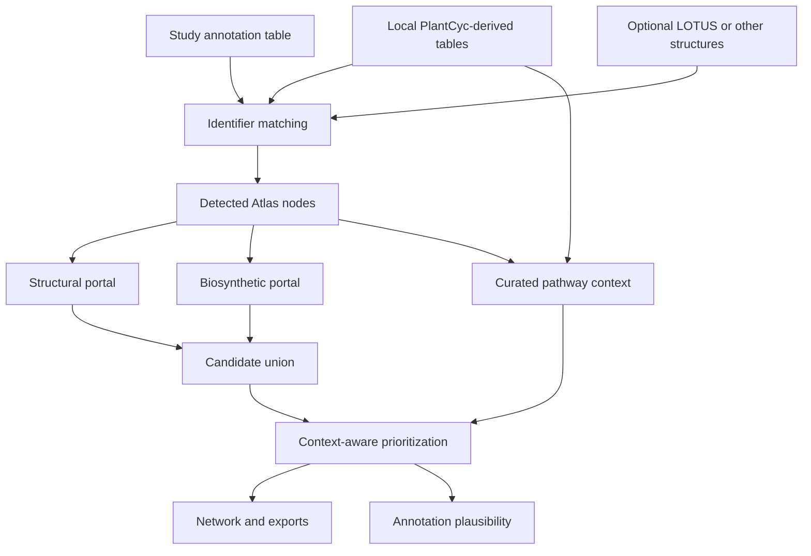

# Biosynthetic Plausibility Mapper

## Detailed installation, data-preparation, analysis, validation, and interpretation tutorial

> **Software status:** research software under active development  
> **Maintainer:** LAABio, Instituto de Pesquisas de Produtos Naturais, Universidade Federal do Rio de Janeiro (IPPN–UFRJ)

## Table of contents

1. [Purpose and scope](#1-purpose-and-scope)
2. [What the application does—and does not do](#2-what-the-application-doesand-does-not-do)
3. [Conceptual workflow](#3-conceptual-workflow)
4. [Data sources and redistribution policy](#4-data-sources-and-redistribution-policy)
5. [Installation](#5-installation)
6. [Preparing the local PlantCyc knowledge base](#6-preparing-the-local-plantcyc-knowledge-base)
7. [Preparing a study-annotation file](#7-preparing-a-study-annotation-file)
8. [Preparing an optional chemical-expansion database](#8-preparing-an-optional-chemical-expansion-database)
9. [Running the application](#9-running-the-application)
10. [Step-by-step routine analysis](#10-step-by-step-routine-analysis)
11. [Understanding the network](#11-understanding-the-network)
12. [Candidate generation and prioritization](#12-candidate-generation-and-prioritization)
13. [Module biosynthetic plausibility](#13-module-biosynthetic-plausibility)
14. [Benchmark modes](#14-benchmark-modes)
15. [Exports and reproducibility](#15-exports-and-reproducibility)
16. [Recommended reporting language](#16-recommended-reporting-language)
17. [Troubleshooting](#17-troubleshooting)
18. [Scientific limitations](#18-scientific-limitations)
19. [Citation and references](#19-citation-and-references)

---

## 1. Purpose and scope

**Biosynthetic Plausibility Mapper** evaluates whether compound annotations from a plant metabolomics study are coherent with curated biosynthetic knowledge and with the other compounds observed in the same study.

The application integrates four information layers:

1. **Study evidence:** compounds supplied by the user and matched to valid structures in the local Atlas.
2. **Curated biosynthesis:** precursor–product relationships reconstructed from an authorized local PlantCyc data copy.
3. **Candidate generation:** independent structural-similarity and curated-network portals.
4. **Interpretation and validation:** candidate prioritization, annotation-level biosynthetic states, assessability diagnostics, and optional benchmark analyses.

The central question is:

> **Does a proposed annotation make biosynthetic sense in the context of the other metabolites observed in the same study?**

The Mapper is designed as a **hypothesis-generation and annotation-review tool**. It is especially useful after LC–HRMS/MS or GC–MS data processing has produced a table of tentative compound annotations.

---

## 2. What the application does—and does not do

### It does

- match study annotations to a harmonized chemical database;
- place matched metabolites in a directed PlantCyc-derived reaction network;
- add curated pathway context around observed compounds;
- propose structurally related compounds using Morgan fingerprints and Tanimoto similarity;
- propose curated biosynthetic neighbors independently of structural similarity;
- record how each candidate entered the candidate universe;
- rank candidates against the complete observed study context;
- assign an interpretable biosynthetic status to each matched annotation;
- distinguish weak biological support from absence of coverage in the knowledge base;
- export interactive networks, GraphML, tables, styles, diagnostics, and benchmark results;
- perform masked, hard-decoy, adversarial-decoy, and prospective-holdout evaluations.

### It does not

- detect compounds directly from raw MS data;
- replace peak picking, deconvolution, alignment, or spectral annotation software;
- prove that a candidate occurs in the sample;
- establish compound identity from biosynthetic context alone;
- convert structural similarity into a curated reaction;
- infer enzyme activity from metabolite presence alone;
- guarantee that a pathway absent from PlantCyc is biologically impossible;
- redistribute PlantCyc source files or bypass their access conditions.

An Atlas result must be integrated with independent analytical evidence: accurate mass, isotope pattern, adduct assignment, chromatographic behavior, MS/MS similarity, retention-index or retention-time evidence, and authentic standards when required.

---

## 3. Conceptual workflow



The two candidate portals are deliberately independent:

| Portal | Starting point | Evidence used | Meaning |
|---|---|---|---|
| Structural | Detected compounds | Morgan fingerprints and Tanimoto similarity | Chemically similar structure |
| Biosynthetic | Detected compounds | Curated PlantCyc reaction-network connectivity | Curated network neighbor |

The final candidate universe is the **union** of the two portals. Candidate origin is provenance, not a confidence grade.

---

## 4. Data sources and redistribution policy

### 4.1 PlantCyc / Plant Metabolic Network

[PlantCyc](https://plantcyc.org/) is the pan-plant reference database within the Plant Metabolic Network (PMN). The current application uses a locally reprocessed subset containing compounds, reactions, pathways, and directed precursor–product relationships.

PlantCyc provides the **biosynthetic backbone**. It is not bundled with this repository. Users must obtain the data through the official PMN/PlantCyc route and comply with the terms, attribution requirements, and access conditions that apply to their downloaded release.

> **Do not commit downloaded PlantCyc files, private download links, access tokens, or reprocessed PlantCyc tables to a public repository unless redistribution has been explicitly authorized.**

The software can be public while the PlantCyc-derived data remain local. A reproducible publication should describe the official source, database release/date, acquisition date, transformation rules, and expected output schema.

### 4.2 LOTUS

[LOTUS](https://lotus.naturalproducts.net/) is an optional natural-products structure and organism-occurrence resource. In the Mapper, a simplified LOTUS table expands the searchable chemical space. It does **not** replace PlantCyc and does not create curated biosynthetic edges.

LOTUS inclusion means only that a structure is available in the expansion database. It does not demonstrate detection in the present sample.

### 4.3 User-supplied annotation data

The annotation table should contain only compounds that the user intends to treat as observed or annotated study inputs. Quantitative and statistical columns are retained as metadata, but they do not currently determine molecular identity.

---

## 5. Installation

### 5.1 Requirements

- Python 3.10 or newer is recommended;
- a current web browser;
- sufficient RAM for the selected chemical-expansion database;
- a local, authorized PlantCyc-derived database folder.

The Python application imports:

- Streamlit;
- pandas;
- NumPy;
- RDKit;
- NetworkX;
- PyVis;
- an Excel reader such as `openpyxl` for `.xlsx` input;
- Pillow when a sidebar logo is used.

### 5.2 Create an isolated environment

#### Windows PowerShell

```powershell
py -m venv .venv
.venv\Scripts\Activate.ps1
python -m pip install --upgrade pip
pip install streamlit pandas numpy networkx pyvis rdkit openpyxl pillow
```

#### Linux or macOS

```bash
python3 -m venv .venv
source .venv/bin/activate
python -m pip install --upgrade pip
pip install streamlit pandas numpy networkx pyvis rdkit openpyxl pillow
```

For a publication or archived release, freeze the exact environment after successful testing:

```bash
python -m pip freeze > requirements-lock.txt
```

### 5.3 Recommended repository structure

```text
Biosynthetic-Plausibility-Mapper/
├── app.py
├── README.md
├── requirements.txt
├── assets/
│   └── logo.png                       # optional
├── plantcyc_atlas_db/                 # local; do not publish without permission
│   ├── atlas_compounds.csv
│   ├── atlas_curated_edges.csv
│   ├── atlas_pathways.csv
│   └── atlas_reactions.csv
└── LOTUS_2021_03_simple.csv           # optional expansion layer
```

Add protected data to `.gitignore`:

```gitignore
plantcyc_atlas_db/
plantcyc*.tar.gz
LOTUS_2021_03_simple*.csv
```

Whether a LOTUS derivative may be redistributed should be evaluated separately from PlantCyc and documented according to the selected LOTUS release and source.

---

## 6. Preparing the local PlantCyc knowledge base

### 6.1 Obtain PlantCyc legitimately

1. Visit the official [PlantCyc/PMN website](https://plantcyc.org/).
2. Register or authenticate if required.
3. Read the applicable terms and download instructions.
4. Download the authorized PlantCyc release.
5. Record the release identifier, acquisition date, and source URL in a local provenance file.
6. Keep the original archive outside the public Git history.

### 6.2 Reprocessing principle

PlantCyc native records are reorganized into analysis-oriented matrices. The reprocessing should:

1. parse compound records and their identifiers;
2. preserve stable PlantCyc frame identifiers;
3. retain names, synonyms, structures, InChIKeys, `TYPES`, and pathway membership when available;
4. parse pathway and reaction records;
5. resolve reaction sides into compound endpoints;
6. retain directionality only when supported by the source representation;
7. propagate reaction, enzyme, EC, pathway, evidence, and provenance fields;
8. export the four required CSV files;
9. validate endpoint resolution and report unresolved or generic structures.

The current `app.py` **loads these generated matrices but is not, by itself, the raw PlantCyc parser**. For full reproducibility, the repository should include a separate preprocessing script that accepts a user-authorized local PlantCyc archive or extracted directory and creates the matrices below. It should not embed or download protected data.

### 6.3 Required files

#### `atlas_compounds.csv`

Minimum useful schema:

| Column | Required | Description |
|---|---:|---|
| `record_id` | Yes | Unique local/PlantCyc compound identifier |
| `name` | Recommended | Preferred compound name |
| `smiles` | Recommended | Valid molecular structure |
| `inchikey` | Recommended | InChIKey for robust identity matching |
| `lotus_id` | No | Cross-reference when available |
| `class` | No | Chemical class |
| `superclass` | No | Broad chemical superclass |
| `pathway` | No | One or more pathway labels; pipe-separated if needed |
| `organism` | No | Source organism metadata |
| `taxonomy` | No | Taxonomic metadata |
| `types` | Recommended | Original PlantCyc `TYPES` values |
| `source_database` | Recommended | Use `PlantCyc` for PlantCyc-derived rows |
| `classification_source` | Recommended | Provenance of class assignment |

The application creates missing record IDs from LOTUS ID, InChIKey, name, or a generated `CMPD_n` identifier. Duplicate IDs receive suffixes. Nevertheless, stable explicit IDs are strongly preferred.

#### `atlas_curated_edges.csv`

| Column | Required | Description |
|---|---:|---|
| `source` | Yes | Precursor endpoint identifier |
| `target` | Yes | Product endpoint identifier |
| `reaction` | Recommended | Reaction name or identifier |
| `enzyme` | No | Enzyme name |
| `ec_number` | No | EC number when available |
| `pathway` | Recommended | Curated pathway context |
| `evidence` | Recommended | Source evidence or provenance |
| `confidence` | No | Numeric value from 0 to 1; default is 1 |
| `directed` | No | Boolean; defaults to `True` |

Endpoint identifiers should resolve to compound records. Resolution in the application prioritizes:

1. InChIKey;
2. canonical SMILES;
3. explicit endpoint ID when unique;
4. conservative name/alias matching.

#### `atlas_pathways.csv`

This table preserves pathway-level metadata used for documentation, auditing, and future analyses. Recommended fields include `pathway_id`, `pathway_name`, `types`, `species`, `evidence`, `citation`, and source-release information.

#### `atlas_reactions.csv`

This table preserves reaction-level metadata. Recommended fields include `reaction_id`, reaction name, left/right participants, direction, enzyme, EC number, pathway membership, evidence, and provenance.

### 6.4 Classification provenance

The Mapper does not silently treat every displayed class as an original PlantCyc assertion.

- Existing `class` and `superclass` fields are preserved.
- When class is missing, the first informative PlantCyc `TYPES` parent may be displayed as class and tagged **`PlantCyc TYPES`**.
- When superclass is missing, a broad superclass may be inferred from PlantCyc `TYPES`, pathway, and name keywords and tagged **`Atlas heuristic from PlantCyc TYPES/pathway`**.
- Generic parents such as `Compounds`, `Chemical-Compounds`, `Acceptors`, and `Donors` do not generate a fabricated class.

Always retain `classification_source` in exports and distinguish source annotations from Atlas conveniences in publications.

### 6.5 Knowledge-base quality control

Before scientific use, check:

- unique `record_id` values;
- valid and canonicalizable SMILES;
- normalized InChIKeys;
- absence of empty edge endpoints;
- fraction of endpoints resolved by InChIKey, SMILES, ID, alias, or name;
- duplicated reactions;
- generic or polymeric structures that RDKit cannot represent usefully;
- directionality and reversible reactions;
- preservation of original evidence and release metadata;
- counts of compounds, reactions, pathways, and resolved edges.

Version the **preprocessing code and manifest**, not protected source data.

---

## 7. Preparing a study-annotation file

### 7.1 Accepted formats

- `.csv`
- `.tsv`
- `.xlsx`
- `.xls`

### 7.2 Matching identifiers

At least one of these fields is needed:

| Preferred order | Canonical column | Accepted examples of aliases |
|---:|---|---|
| 1 | `inchikey` | `inchi_key`, `inchi key` |
| 2 | `lotus_id` | `lotusid`, `lotus id` |
| 3 | `smiles` | `canonical_smiles`, `isomeric_smiles` |
| 4 | `name` | `compound`, `compound_name`, `metabolite_name` |

Use InChIKey whenever possible. Name matching is the least robust because spelling, stereochemical descriptors, salt forms, and synonyms vary across resources.

### 7.3 Minimal example

```csv
record_id,name,inchikey,smiles,confidence_level,feature_id
ANN_001,caffeic acid,QAIPRVGONGVQAS-DUXPYHPUSA-N,O=C(O)/C=C/c1ccc(O)c(O)c1,2,F1042
ANN_002,naringenin,FTVWIRXFELQLPI-ZDUSSCGKSA-N,O=C1CC(c2ccc(O)cc2)Oc2cc(O)cc(O)c21,3,F1884
```

### 7.4 Extra study metadata

Additional columns are preserved, for example:

- `feature_id`;
- `mz` and `retention_time`;
- `ion_mode` and `adduct`;
- `msms_score` or library cosine;
- `annotation_level`;
- `fold_change`, `p_value`, `q_value`, and `VIP`;
- `group`, `sample`, and `abundance`;
- free-text notes.

These columns help audit results but are not automatically equivalent to identity evidence unless explicitly used by the implementation.

### 7.5 Input recommendations

- one row per intended annotation;
- retain stereochemistry when supported;
- do not mix alternative identities in one name cell;
- use separate rows for isomeric hypotheses;
- remove blank rows and spreadsheet titles above the header;
- use decimal points, not locale-dependent formatting, for numeric values;
- freeze the input file used in each analysis;
- do not include prospective holdouts in the visible input.

---

## 8. Preparing an optional chemical-expansion database

The expansion table uses the compound schema described above. The bundled filename recognized by the current app is `LOTUS_2021_03_simple.csv` or `LOTUS_2021_03_simple(2).csv`, but users may upload another CSV, TSV, or Excel table.

PlantCyc compounds remain the primary biosynthetic reference. Expansion compounds are added only when they are not already represented in PlantCyc.

Load modes are:

- **25,000 records:** quick test;
- **50,000 records:** prototype/default practical test;
- **100,000 records:** broader search;
- **Full database:** maximum coverage and memory demand.

Increasing the database size can improve candidate coverage but also increases computation, memory use, and the number of structurally plausible false alternatives. Record the selected database and row limit.

---

## 9. Running the application

From the repository directory:

```bash
streamlit run app.py
```

Streamlit opens the application in a browser. If it does not open automatically, follow the local URL printed in the terminal.

To stop the application, return to the terminal and press `Ctrl+C`.

---

## 10. Step-by-step routine analysis

### Step 1 — Confirm the PlantCyc knowledge base

The sidebar must show **PlantCyc database detected**. If files were replaced while the app was running, click **Refresh knowledge-base cache** once. Refreshing is unnecessary during a normal unchanged run.

### Step 2 — Upload study annotations

Upload the annotation table under **Detected or annotated compounds**. The file defines the observed study context.

### Step 3 — Configure chemical expansion

Enable the expansion database when the analysis should search beyond compounds already present in PlantCyc. For initial testing, use 25,000–50,000 records. Use the full database only after the workflow and input file have been validated.

### Step 4 — Configure the biosynthetic portal

- **Generate biosynthetic candidates from curated PlantCyc reactions:** normally enabled.
- **Biosynthetic candidate depth:** maximum reaction-network distance from a detected compound; default `1` is the most conservative.
- **Add additional curated pathway context for visualization:** adds context nodes without redefining them as detected.
- **Additional curated context depth:** maximum context expansion depth; start at `1`.

Greater depth improves contextual coverage but can create broad, less specific networks.

### Step 5 — Configure the structural portal

Recommended starting settings:

| Setting | Suggested start | Interpretation |
|---|---:|---|
| Neighbors per detected compound | 8 | Top-N structural hypotheses per detected seed |
| Minimum Morgan similarity | 0.60 | Structural inclusion threshold |
| Mass-difference tolerance | 0.040 Da | Tolerance for labeling a known nominal transformation |
| Connect neighboring candidates | Off | Avoids unnecessary graph density initially |
| Maximum candidate–candidate edges | 100 if enabled | Limits neighborhood clutter |
| Morgan radius | 2 | Circular neighborhoods up to radius 2 |
| Fingerprint size | 2048 bits | Reduces hashing collisions relative to smaller vectors |

These are analysis parameters, not universal biochemical constants. Sensitivity analysis is recommended for formal studies.

### Step 6 — Build the Atlas

Click **Build atlas network**. The app calculates a stable signature from the current inputs and settings and reuses stored results when the identical analysis has already been run. Download buttons are passive and should not trigger the analysis again.

### Step 7 — Inspect matching before interpretation

Open **Study matches** and inspect:

- matched annotations;
- unmatched annotations;
- match method;
- conflicting or duplicated identities;
- stereochemistry and parent-structure reconciliation;
- whether the expected number of study compounds became detected nodes.

Never interpret plausibility before resolving major matching problems.

### Step 8 — Inspect candidates and edges

Use the **Candidate nodes** and **Edges** tabs to determine:

- candidate origin: structural, biosynthetic, or both;
- nearest detected seed;
- Morgan/Tanimoto similarity;
- curated reaction or pathway support;
- inferred mass-difference label;
- whether an edge is curated, inferred, or a neighborhood edge.

### Step 9 — Review candidate prioritization

Candidate prioritization asks which proposed candidates best fit the full detected context. Treat the ranking as a triage list for targeted MS/MS review, standards, or future acquisition—not as a list of detected metabolites.

### Step 10 — Run module biosynthetic plausibility

Review the four annotation states and the component evidence. Investigate annotations flagged for review and inspect the compound-to-supporting-compound evidence table.

### Step 11 — Export results

Download the complete ZIP after the intended analyses are complete. Preserve the input annotation file, software commit, parameter settings, PlantCyc release manifest, expansion-database version, and result ZIP together.

---

## 11. Understanding the network

### 11.1 Node types

| Appearance | Role | Meaning |
|---|---|---|
| Red diamond | **Detected in study** | User-supplied annotation successfully matched to an Atlas structure |
| Green box | **Curated pathway context** | PlantCyc-derived compound added to show biosynthetic context |
| Translucent blue circle | **Candidate** | Proposed by one or both candidate portals |
| Translucent gray node | **Orphan/unassigned** | Lowest-confidence contextual assignment |

A node can be present in the Atlas without being experimentally detected. The `role` and `detected` attributes must be preserved in downstream analysis.

### 11.2 Edge types

| Appearance | Edge class | Interpretation |
|---|---|---|
| Solid green arrow | Curated reaction | Directed PlantCyc-derived precursor-to-product relationship |
| Dashed gray edge | Inferred relationship | Structural similarity with a recognized or unrecognized mass difference |
| Dotted light-gray edge | Neighborhood relationship | Candidate-to-candidate structural similarity |

An inferred transformation label is a mass-pattern description, not proof of an enzyme or reaction mechanism.

### 11.3 Views

**Pathway view** uses a hierarchical left-to-right arrangement and emphasizes reaction direction, branches, and gaps.

**Neighborhood view** uses a force-directed arrangement and emphasizes local connectivity and structural neighborhoods.

Physical screen distance is a visualization property and must not be reported as a quantitative biological distance.

### 11.4 Grouping and labels

Nodes can be grouped by pathway, class, or superclass. Edge labels can display reaction, enzyme, pathway, EC number, or combinations. Candidate labels are hidden by default to reduce clutter; full metadata remain available on hover.

---

## 12. Candidate generation and prioritization

### 12.1 Structural candidates

RDKit generates Morgan circular fingerprints for valid structures. Similarity is measured using the Tanimoto coefficient:

$$
T(A,B)=\frac{|A\cap B|}{|A|+|B|-|A\cap B|}
$$

where $A$ and $B$ are the sets of on-bits in the two fingerprints. Higher values indicate greater fingerprint overlap, not biological relatedness.

### 12.2 Common mass-difference labels

The implementation can label differences near common transformations, including redox/±H₂, methylation/±CH₂, hydroxylation/±O, hydration/dehydration, acetylation, prenylation, sulfation, pentosylation, deoxyhexosylation, hexosylation, and glucuronidation.

These labels are heuristic interpretations of mass differences. Isomers, adduct errors, neutral-loss coincidences, and unrelated elemental changes may yield similar differences.

### 12.3 Biosynthetic candidates

Biosynthetic candidates are obtained by traversing curated edges from detected compounds up to the selected depth. Morgan similarity is not required for this portal.

### 12.4 Why candidate provenance and ranking are separate

- **Provenance** answers: *How did this molecule enter the candidate universe?*
- **Prioritization** answers: *How well does it fit the complete observed context?*
- **Detection** answers: *Was it supported by experimental data?*

These questions must not be collapsed into a single confidence statement.

---

## 13. Module biosynthetic plausibility

### 13.1 Annotation states

| State | Practical interpretation |
|---|---|
| **Biosynthetically supported** | Curated/contextual evidence materially strengthens the annotation |
| **Plausible** | No major biosynthetic conflict, but support is incomplete |
| **Ambiguous** | Available context cannot resolve the annotation confidently |
| **Biosynthetically unsupported / suspicious** | The annotation requires careful review under the available knowledge base |

“Unsupported” means unsupported **under the current data, database coverage, identity mapping, and model**, not biologically impossible.

### 13.2 Engine v3.1 evidence components

The frozen v3.1 score combines:

$$
S_{v3.1}=0.25S_{reaction}+0.20S_{pathway}+0.15S_{nearest\ network}+0.25S_{global\ coherence}+0.15S_{structure}
$$

Global context coherence is:

$$
S_{global}=0.35C_{reaction}+0.30C_{pathway}+0.35C_{network}
$$

where:

- $C_{reaction}$ is the fraction of observed context compounds directly connected by curated reactions;
- $C_{pathway}$ is the fraction sharing curated pathway context;
- $C_{network}$ summarizes curated-network support across the observed context.

The global term prevents a single excellent local connection from automatically receiving maximal confidence.

### 13.3 Candidate-specific modules

A complex plant extract may contain multiple unrelated pathways. Therefore, annotation evidence is also examined within a candidate-specific module composed of observed compounds linked by:

- direct curated reaction;
- shared pathway;
- short curated-network distance.

Inspect `module_basis`, `module_size`, pathway coverage, mean network coverage, context coherence, and the compound-to-supporting-compound evidence table.

### 13.4 Assessability

The application distinguishes a low score from poor database coverage. Assessability diagnostics help identify cases in which:

- no useful module was recovered;
- structures or identities could not be reconciled;
- PlantCyc has limited relevant coverage;
- support is based on only one local anchor;
- strong structural similarity is not accompanied by curated biosynthetic evidence.

### 13.5 Experimental use

Use biosynthetic status as an **orthogonal confidence layer**. For ambiguous or suspicious annotations:

1. verify precursor and adduct assignment;
2. inspect MS/MS fragments and library matches;
3. examine isomerism and stereochemistry;
4. inspect direct curated reaction partners;
5. inspect shared pathways and network distance;
6. check whether the relevant chemistry is represented in PlantCyc;
7. acquire a standard or targeted MS/MS when scientifically important.

---

## 14. Benchmark modes

Benchmarking validates the method. It is **not required for routine analysis** and should not be rerun merely to download results.

### 14.1 Prospective holdout evaluation

This is the preferred external-style validation when a genuinely frozen hidden set is available.

1. Split compounds into visible input and holdout **before** building the Atlas.
2. Build the Atlas using only visible compounds.
3. Confirm candidate prioritization is complete.
4. Upload the frozen holdout table in the Benchmark tab.
5. Click **Evaluate prospective holdout**.

The evaluator checks leakage against Atlas nodes marked `detected`, using exact InChIKey, LOTUS ID, and canonical SMILES first. Name-only leakage is used only when the holdout lacks molecular identifiers. If a holdout compound is already detected, evaluation is blocked.

Metrics include candidate-generation recall, Recall@5/@10/@20/@50/@100/@200, mean reciprocal rank (MRR), recovered ranks, candidate origin, and tier-specific performance when `holdout_tier` is present.

Suggested holdout columns:

```csv
name,inchikey,smiles,holdout_tier
compound A,AAAAAAAAAAAAAA-BBBBBBBBBB-C,CCO,high-confidence
```

### 14.2 Legacy masked-metabolite retrieval benchmark

For each eligible pathway, one true metabolite is hidden while the remaining pathway compounds define the visible context. All database compounds are ranked.

Primary metrics:

- **Recall@k:** fraction of trials in which the hidden compound appears among the top $k$ candidates;
- **MRR:** mean of reciprocal true ranks;
- **median/mean rank:** absolute recovery position;
- **rank percentile:** normalized position across differently sized candidate universes.

The legacy comparison contains structural and reaction-aware engine variants. Exact edges touching the hidden compound are removed where specified to reduce leakage.

### 14.3 Engine v3 Level 1: hard structural decoys

Level 1 evaluates whether biosynthetic context distinguishes a true pathway compound from structurally similar but biosynthetically unrelated alternatives.

For each trial:

1. select a real PlantCyc pathway;
2. mask one true compound;
3. use the remaining compounds as observed context;
4. select high-similarity decoys outside the gold pathway and not directly connected to visible context;
5. score and rank the true annotation with the decoys.

Metrics include AUROC, AUPRC, Top-1 accuracy, Top-3 accuracy, median true rank, and score margin.

Chemical class, superclass, and PlantCyc `TYPES` are descriptive exports and are not used in the v3 score.

### 14.4 Engine v3.1 Level 2: biosynthetic adversarial decoys

Level 2 retains difficult alternatives that can themselves be biosynthetically plausible:

- **biosynthetic-neighbor decoys:** direct curated neighbors of visible compounds but outside the gold pathway;
- **pathway decoys:** compounds sharing alternative pathway/network context with visible compounds.

A negative margin means the adversarial alternative outranked the masked gold compound under the score. It is a prioritization failure for that trial, not proof that the decoy is biologically false.

Interpret AUROC/AUPRC together with Top-k accuracy, median true rank, score margin, decoy type, and failed-trial diagnostics.

### 14.5 Leakage rules

Never allow a hidden reference to participate in:

- the detected input set;
- candidate generation as an observed seed;
- context-score construction;
- parameter tuning on the same final test set.

Curated database presence is not automatically leakage; use of the hidden identity as observed study evidence is leakage. Report the exact masking and edge-removal rules.

### 14.6 Repeated runs

Use a fixed random seed for reproducibility. The current application stores completed analyses in session state and compares run signatures so an unchanged button action or download does not recompute the same benchmark.

---

## 15. Exports and reproducibility

### 15.1 Common exports

Depending on completed analyses, exports include:

- node table;
- edge table;
- matched and unmatched annotations;
- resolved curated reactions;
- candidate prioritization;
- GraphML network;
- interactive HTML network;
- Cytoscape style XML;
- experimental plausibility results;
- identity reconciliation;
- assessability and unsupported-coverage audits;
- module diagnostics and support evidence;
- prospective-holdout results and summaries;
- legacy and v3/v3.1 benchmark tables;
- settings and manifest information in the complete ZIP.

### 15.2 Which format to use

| Format | Best use |
|---|---|
| CSV | statistical analysis, auditing, supplementary tables |
| GraphML | Cytoscape, Gephi, NetworkX, and long-term graph exchange |
| HTML | interactive local viewing and sharing when appropriate |
| Cytoscape XML style | reconstructing the intended node/edge appearance |
| ZIP | archiving the complete run together |

### 15.3 Minimum reproducibility record

Archive:

- application commit/tag and version;
- Python version and locked dependencies;
- study input file checksum;
- PlantCyc release and acquisition date;
- preprocessing-script version and settings;
- counts and endpoint-resolution diagnostics;
- expansion-database release, checksum, and row limit;
- Morgan radius, fingerprint size, similarity threshold, and Top-N;
- biosynthetic and visualization depths;
- random seeds and benchmark settings;
- all output tables and manifests.

Do not archive protected PlantCyc data in a public supplement unless permission explicitly permits it.

---

## 16. Recommended reporting language

### 16.1 Methods template

> Study annotations were evaluated with Biosynthetic Plausibility Mapper (version/commit ___). A local database was generated from an authorized PlantCyc release (release ___; acquired ___) using preprocessing script version ___, yielding compound, pathway, reaction, and directed curated-edge matrices. PlantCyc-derived files were not redistributed. Study compounds were matched by InChIKey, LOTUS identifier, canonical SMILES, and compound name, in that priority order. The chemical search space was optionally expanded with LOTUS release ___ (___ records loaded). Structural candidates were generated with RDKit Morgan fingerprints (radius ___; ___ bits), Tanimoto similarity ≥ ___, and a maximum of ___ neighbors per detected compound. Biosynthetic candidates were obtained by traversing curated PlantCyc edges to depth ___. Candidate provenance and biosynthetic plausibility were evaluated separately. Random seed ___ was used for benchmark analyses.

### 16.2 Results template

> Of ___ uploaded annotations, ___ were matched to valid Atlas structures. The final network contained ___ detected, ___ curated-context, and ___ candidate nodes connected by ___ curated and ___ inferred edges. Among matched annotations, ___ were classified as biosynthetically supported, ___ plausible, ___ ambiguous, and ___ unsupported/suspicious under the current knowledge-base coverage. These states were interpreted as contextual evidence and not as independent proof of chemical identity.

### 16.3 Wording to avoid

Avoid statements such as:

- “the software identified the compound” when it only prioritized it;
- “PlantCyc proves the metabolite is present”;
- “unsupported compounds cannot occur in plants”;
- “Tanimoto similarity demonstrates a biosynthetic reaction”;
- “all green nodes were experimentally detected.”

---

## 17. Troubleshooting

### PlantCyc database not detected

Confirm that `plantcyc_atlas_db` is beside `app.py` and contains all four required filenames exactly.

### No annotations match

- check header names;
- remove spaces or hidden characters from identifiers;
- confirm InChIKeys and SMILES belong to neutral/parent structures as intended;
- compare stereochemical forms;
- inspect name spelling and synonyms;
- confirm the relevant database was loaded.

### RDKit warnings or few valid structures

Some PlantCyc records may represent generic groups, polymers, Markush-like entities, or unsupported valence states. Inspect database diagnostics; do not coerce invalid structures silently.

### Network is too dense

- reduce neighbors per detected compound;
- raise minimum similarity;
- disable candidate-to-candidate edges;
- reduce biosynthetic/context depth;
- hide candidate labels;
- use Pathway view or filter node roles.

### Analysis is slow or uses too much memory

- load 25,000 or 50,000 expansion records;
- disable candidate-to-candidate connections;
- reduce Top-N;
- avoid repeatedly clearing caches;
- close unused sessions;
- record the reduced search space in the methods.

### Holdout leakage detected

Rebuild the Atlas using only the visible/input set. Do not remove detected labels after building; the candidate universe must be generated without holdout observations.

### Download appears to rerun the calculation

Use the current version of the app. Downloads are implemented as passive buttons backed by stored snapshots. If inputs or settings changed, rebuild intentionally before downloading.

### Empty or weak biosynthetic modules

Inspect identity reconciliation, PlantCyc coverage, unresolved edges, generic structures, and assessability. A weak module may reflect missing knowledge rather than a chemically incorrect annotation.

---

## 18. Scientific limitations

1. **Knowledge-base incompleteness:** plant specialized metabolism is incompletely characterized and unevenly curated across taxa and compound classes.
2. **Species context:** PlantCyc is pan-plant; a curated reaction in Viridiplantae is not automatically demonstrated in the studied species, tissue, or condition.
3. **Structure representation:** salts, tautomers, protonation states, stereoisomers, glycosides, generic groups, and polymers complicate identity reconciliation.
4. **Directionality:** database reaction direction may depend on curation, physiology, reversibility, and representation choices.
5. **Similarity:** fingerprint similarity is representation- and parameter-dependent and is not a biochemical mechanism.
6. **Mass-difference heuristics:** the same nominal difference can have multiple chemical explanations.
7. **Annotation dependence:** incorrect input identities can create apparently coherent but misleading modules.
8. **Occurrence evidence:** a structure in LOTUS or PlantCyc is not evidence that it occurs in the present sample.
9. **Score calibration:** a weighted plausibility score is a prioritization device, not a universal probability unless independently calibrated as such.
10. **Benchmark dependence:** internal pathway masking and decoy benchmarks may not fully represent real experimental error, unknown metabolites, or out-of-database chemistry.
11. **Taxonomic and abundance evidence:** these may be preserved as metadata but are not necessarily components of the frozen score.
12. **Causal interpretation:** metabolite co-observation does not prove pathway flux, enzyme expression, or causal transformation.

The scientifically appropriate interpretation is **biosynthetic contextual plausibility under an explicitly defined knowledge base and parameterization**.

---

## 19. Citation and references

### 19.1 Cite this software

Until the software article is published, cite the repository release and archived DOI, when available:

> Borges, R. M., et al. *Biosynthetic Plausibility Mapper: mapping experimental plant metabolomes onto curated biosynthetic knowledge*. Software repository, version ___, year ___, URL/DOI ___.

Replace placeholders with the exact release used.

### 19.2 PlantCyc and PMN

1. Hawkins C, et al. Plant Metabolic Network 16: expansion of underrepresented species and enhanced enzyme information. *Nucleic Acids Research*. 2025;53(D1):D1606–D1613. [https://doi.org/10.1093/nar/gkae991](https://doi.org/10.1093/nar/gkae991)
2. Schläpfer P, et al. Genome-wide prediction of metabolic enzymes, pathways, and gene clusters in plants. *Plant Physiology*. 2017;173(4):2041–2059. [https://doi.org/10.1104/pp.16.01942](https://doi.org/10.1104/pp.16.01942)
3. Zhang P, et al. Creation of a genome-wide metabolic pathway database for Populus trichocarpa using a new approach for reconstruction and curation of metabolic pathways for plants. *Plant Physiology*. 2010;153(4):1479–1491. [https://doi.org/10.1104/pp.110.157396](https://doi.org/10.1104/pp.110.157396)
4. Plant Metabolic Network / PlantCyc. Official resource: [https://plantcyc.org/](https://plantcyc.org/)

Use the citation requested by the exact PlantCyc release and download page in addition to, or instead of, older database papers when instructed by PMN.

### 19.3 LOTUS

5. Rutz A, Sorokina M, Galgonek J, et al. The LOTUS initiative for open knowledge management in natural products research. *eLife*. 2022;11:e70780. [https://doi.org/10.7554/eLife.70780](https://doi.org/10.7554/eLife.70780)
6. LOTUS Natural Products Online. [https://lotus.naturalproducts.net/](https://lotus.naturalproducts.net/)

### 19.4 Molecular fingerprints and cheminformatics

7. Rogers D, Hahn M. Extended-connectivity fingerprints. *Journal of Chemical Information and Modeling*. 2010;50(5):742–754. [https://doi.org/10.1021/ci100050t](https://doi.org/10.1021/ci100050t)
8. RDKit: Open-source cheminformatics software. [https://www.rdkit.org/](https://www.rdkit.org/) and [RDKit documentation](https://www.rdkit.org/docs/)

### 19.5 Network analysis and visualization

9. Hagberg AA, Schult DA, Swart PJ. Exploring network structure, dynamics, and function using NetworkX. In: *Proceedings of the 7th Python in Science Conference*. 2008:11–15. [https://networkx.org/](https://networkx.org/)
10. PyVis documentation. [https://pyvis.readthedocs.io/](https://pyvis.readthedocs.io/)
11. Cytoscape Consortium. Cytoscape documentation and software. [https://cytoscape.org/](https://cytoscape.org/)

### 19.6 Application framework and data analysis

12. Streamlit documentation. [https://docs.streamlit.io/](https://docs.streamlit.io/)
13. pandas documentation. [https://pandas.pydata.org/docs/](https://pandas.pydata.org/docs/)
14. NumPy documentation. [https://numpy.org/doc/](https://numpy.org/doc/)

### 19.7 Reference-management note

For a manuscript, verify bibliographic metadata against Crossref, PubMed, or the publisher at submission time, and cite the exact versions/releases used. Software documentation links explain implementation dependencies; primary database and method papers should carry the scientific citations.

---

## Acknowledgment and disclaimer

PlantCyc/PMN and LOTUS are independent external resources and are not distributed as part of this application. Their inclusion here describes interoperability and does not imply endorsement. Users are responsible for complying with database terms and for the scientific interpretation of results.

**Biosynthetic Plausibility Mapper produces contextual hypotheses. Final metabolite identification remains an experimental and expert-curated decision.**
